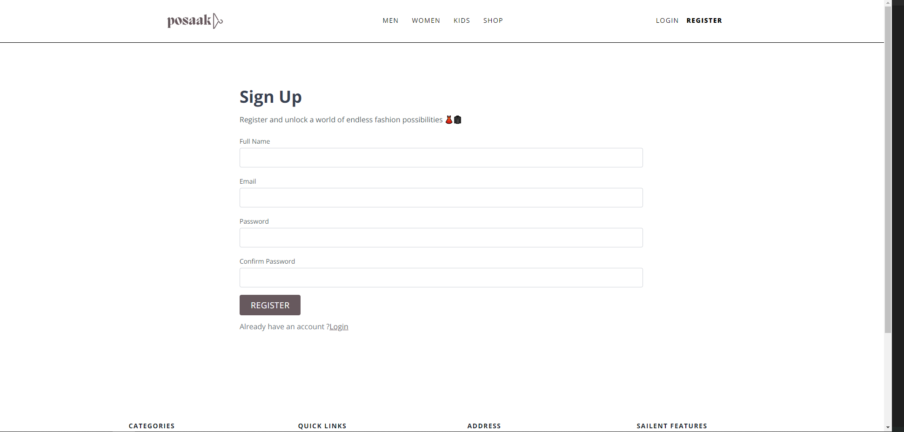
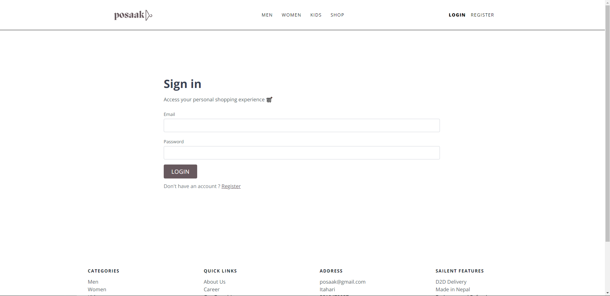
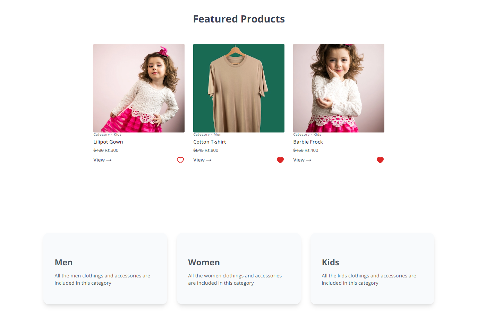
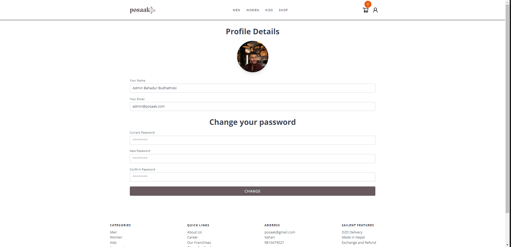
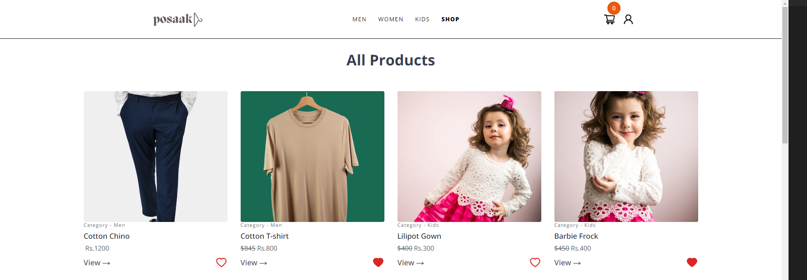
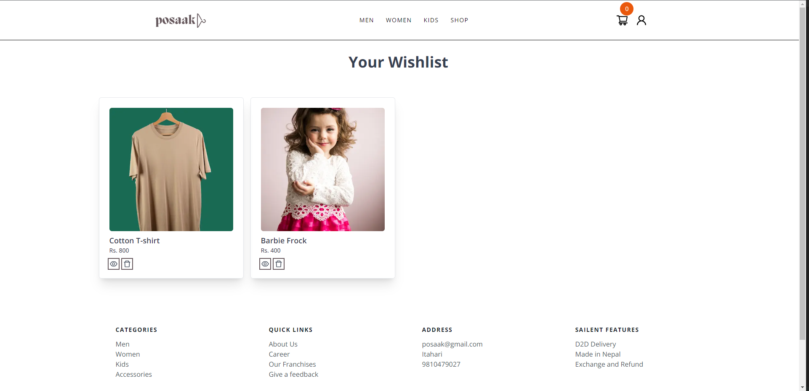
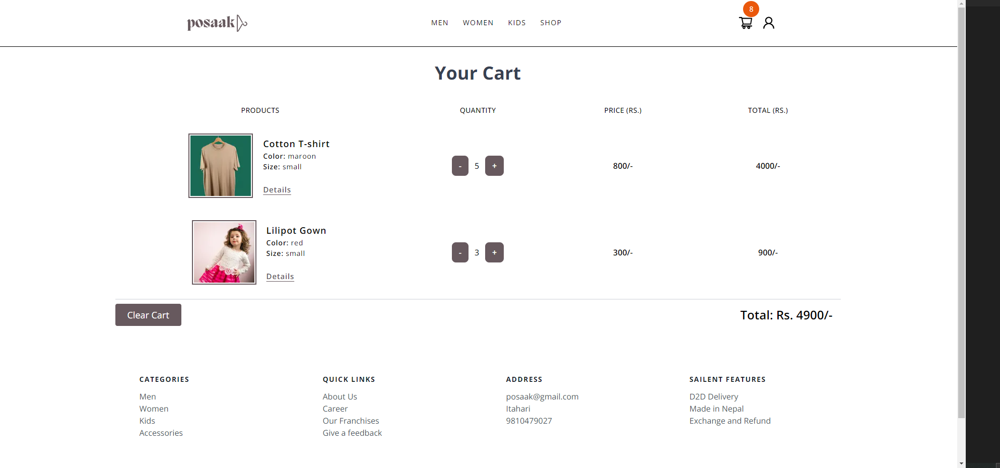

# eCommerce Website - Posaak (Under Development)

## Project Overview

This is an eCommerce site for a fictional store named 'Posaak', built with Next.js, MongoDB, Express, and Node.js. It allows users to browse and purchase products, track orders, and more.

## Features

- User Registration and Login with JWT
- User Profile and Updation
- Product Catalog (List) with categories and filters
- Shopping cart functionality
- WishLists
- Order history
- Search and sort Functionality
- Admin dashboard for managing products and orders

## Technologies Used

- Next.js
- MongoDB
- Express
- Node.js
- Tailwind CSS

## Some Demo

Landing Page

Sign up Form

Login up Form

Hero Section

Featured Products and Shopy By Category

User Profile

All Products

Wish List

Cart

